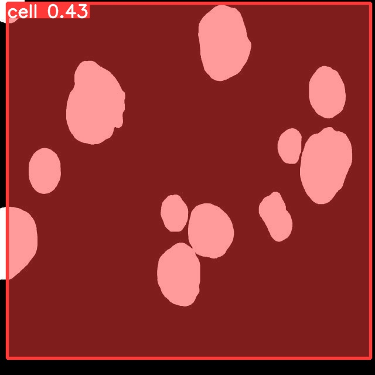
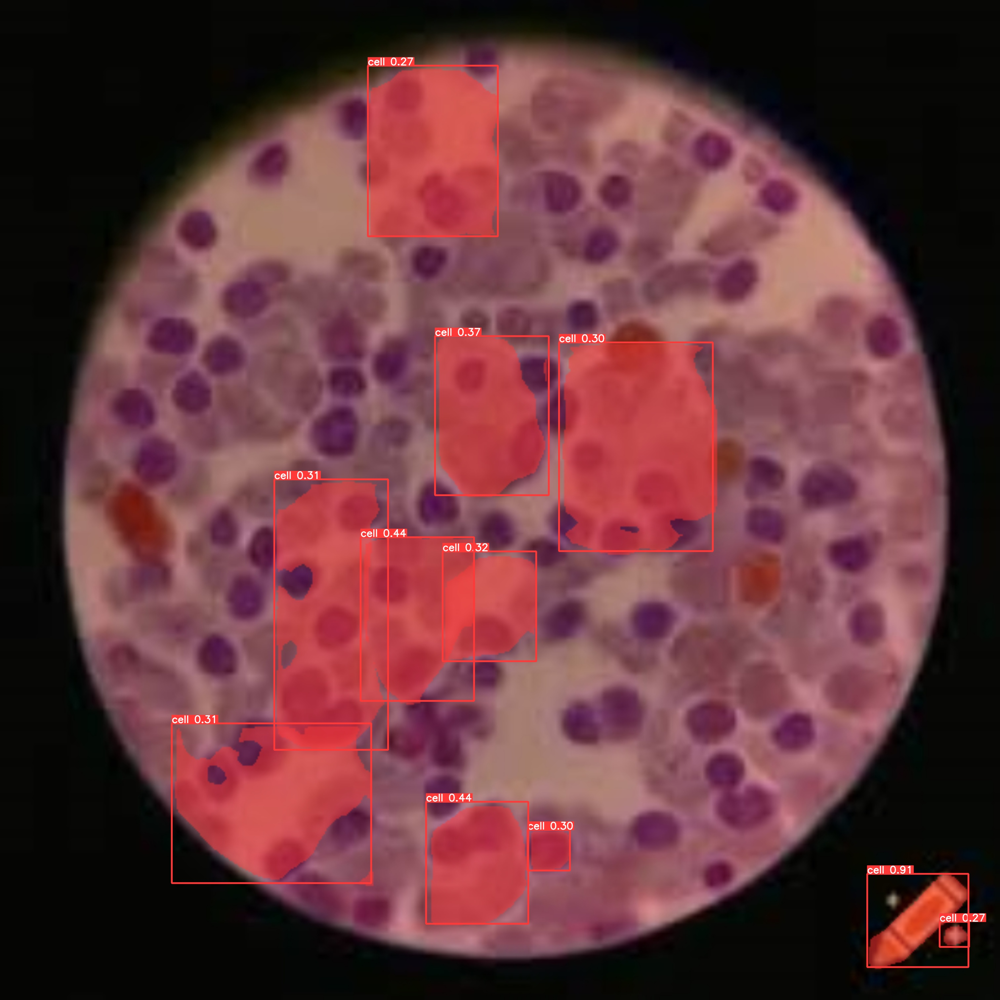

🧫 END-TO-END CELL SEGMENTATION USING YOLOv8 WITH DEPLOYMENT

------------------------------------------------------------

📌 PROJECT OVERVIEW

This project performs **cell instance segmentation** from microscopy images using the **YOLOv8 model**.  
It includes a complete pipeline for data ingestion, validation, model training, and deployment-ready inference.

The project is designed using a clean, modular structure suitable for real-world AI/ML applications.


🚀 FEATURES

✅ 🧠 YOLOv8-based cell segmentation  
✅ 📦 Modular project architecture  
✅ ⚙️ Training and inference pipelines  
✅ 🖼️ Real-time visualization of results  
✅ 🌐 Streamlit web interface  
✅ 🐳 Docker deployment ready  


🛠️ TECH STACK

• Python 3.10+  
• PyTorch  
• Ultralytics YOLOv8  
• OpenCV  
• NumPy  
• Streamlit  
• Docker  


📁 PROJECT STRUCTURE

```

End-To-End-Cell-Segmentation-Using-Yolo-V8-With-Deployment/
│
├── app.py
├── Dockerfile
├── README.md
├── requirements.txt
├── setup.py
├── template.py
│
├── artifacts/
│   └── model_trainer/
│       └── best.pt
│
├── cellSegmentation/
│   ├── components/
│   │   ├── data_ingestion.py
│   │   ├── data_validation.py
│   │   └── model_trainer.py
│   │
│   ├── constant/
│   │   └── training_pipeline/
│   │       └── **init**.py
│   │
│   ├── entity/
│   │   ├── artifacts_entity.py
│   │   └── config_entity.py
│   │
│   ├── exception/
│   │   └── **init**.py
│   │
│   ├── logger/
│   │   └── **init**.py
│   │
│   ├── pipeline/
│   │   ├── training_pipeline.py
│   │   └── **init**.py
│   │
│   └── utils/
│       ├── main_utils.py
│       └── **init**.py
│
├── data/
│   ├── cell_data.zip
│   └── inputImage.jpg
│
├── research/
│   ├── trials.ipynb
│   ├── trials.py
│   └── yolov8_instance_segmentation_on_custom_dataset.ipynb
│
├── runs/
│   └── segment/
│       └── predict*/
│           └── inputImage.jpg
│
└── templates/
└── index.html

```


⚙️ INSTALLATION

1️⃣ Clone the repository

```

git clone [https://github.com/your-username/End-To-End-Cell-Segmentation-Using-Yolo-V8-With-Deployment.git](https://github.com/your-username/End-To-End-Cell-Segmentation-Using-Yolo-V8-With-Deployment.git)
cd End-To-End-Cell-Segmentation-Using-Yolo-V8-With-Deployment

```

2️⃣ Create virtual environment

```

python -m venv venv

```

Activate environment:

Windows:
```

venv\Scripts\activate

```

Linux / Mac:
```

source venv/bin/activate

```

3️⃣ Install dependencies

```

pip install -r requirements.txt

```


▶️ RUN THE APPLICATION

```

streamlit run app.py

```

Then open:
```

[http://localhost:8501](http://localhost:8501)

```


🧠 TRAIN THE MODEL

```

python cellSegmentation/pipeline/training_pipeline.py

```


📸 SAMPLE OUTPUT

🖼️ Input Image:



🖼️ Segmented Output:




🐳 DOCKER DEPLOYMENT

Build Docker image:

```

docker build -t cell-segmentation-yolov8 .

```

Run container:

```

docker run -p 8501:8501 cell-segmentation-yolov8

```


👨‍💻 AUTHOR

Sarthak Kelkar


📄 LICENSE

MIT License
```


Just tell me: **"make it downloadable"**
